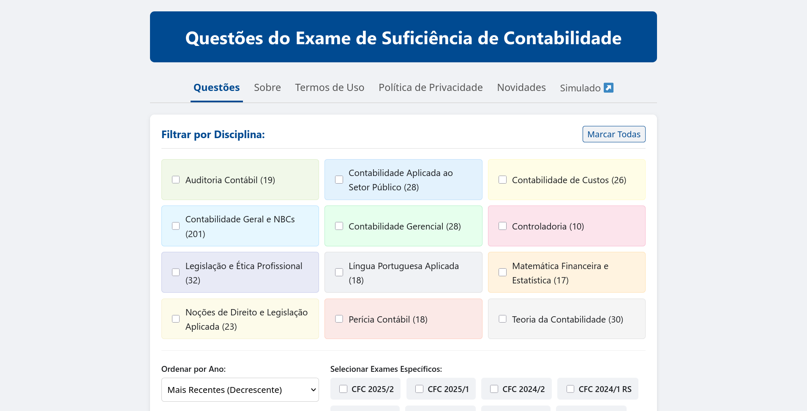
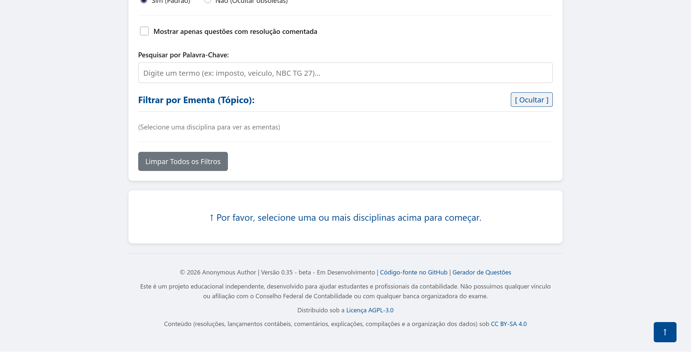
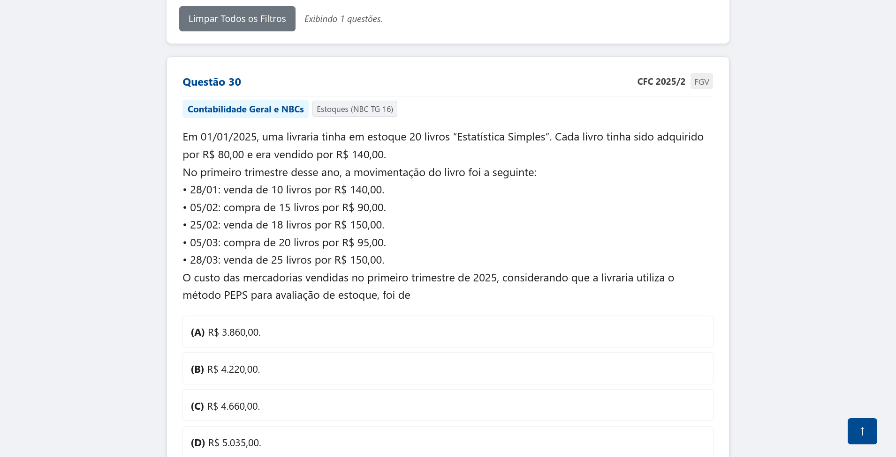
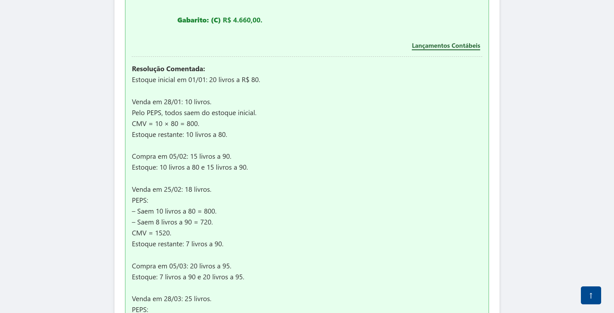
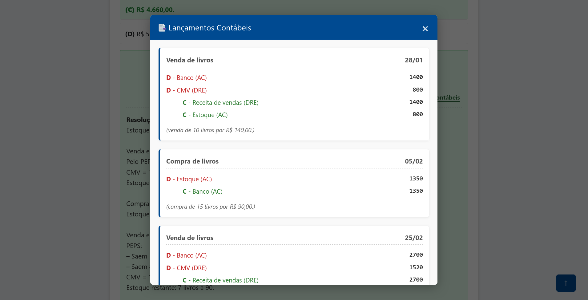
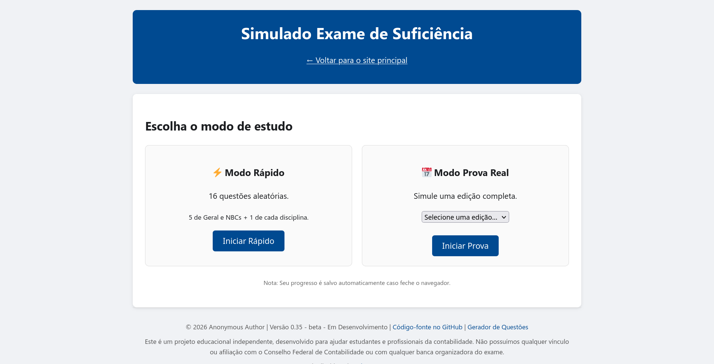
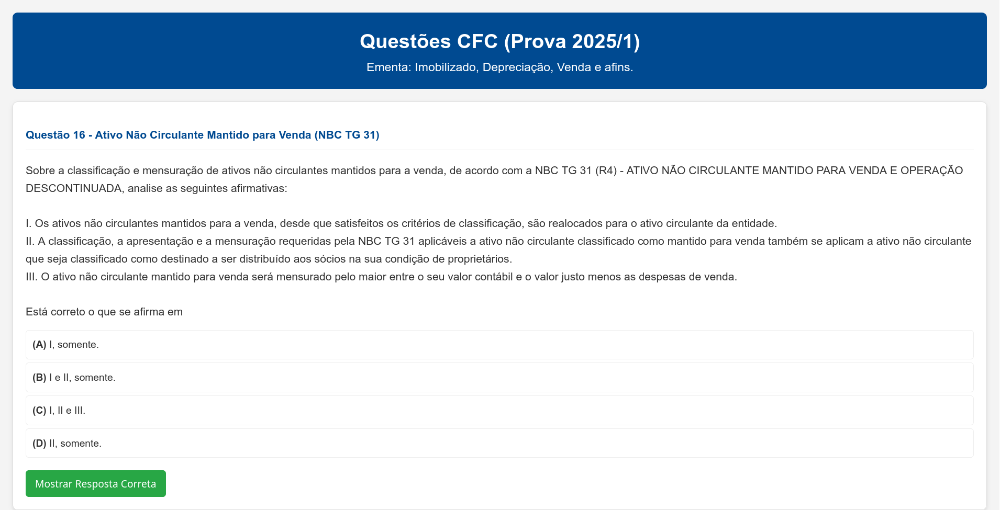

# Article Repository

#### Portuguese version [README-pt-br.md](README-pt-br.md)

## Welcome

This repository was created to store the tests for the article "Accounting education: An educational artifact based on open technologies for preparation for the Sufficiency Examination".

## Failure rate average calculation

[...] "the average failure rate was 73.79% in relation to the candidates present, with 2023 delivering the worst result, at 82.65%".

You can find the failure rate average calculation, addressed in topic 2.1 of the excerpt above, [in this file](<testes-artefato/docs/Cálculo aprovação no Exame.xlsx>).

## Website versions

Version 0.21, cited in the article's Online Platform section, is available in the [testes-artefato/versions](testes-artefato/versions) folder.

## Prompts

- The prompt used for Extraction and Classification of the questions can be found at [Prompt Extração e Classificação.md](<testes-artefato/docs/Prompts/Prompt Extração e Classificação.md>).

- The prompt used for the Accounting Persona can be accessed at [Persona Contábil](<testes-artefato/docs/Prompts/Persona Contábil.md>).

- The folder [testes-artefato/Google AI Studio](<testes-artefato/Google AI Studio>) contains Gemini's output and its parameterization in the [Persona](<testes-artefato/Google AI Studio/Persona>) and in [step 3 - Data Transformation](<testes-artefato/Google AI Studio/Transformação dos dados>).

## Sanitization script used in Artifact 1

- Version 0.21: This version uses the Google API mentioned in topic 4.1 Artifact Design and Development. Access it [here](testes-artefato/versions/0.21/etl/main.py). Check the [manual](testes-artefato/versions/0.21/etl/README.md).

- Version 0.35: The latest version of the tag sanitization script can be found [here](etl/main.py). Check the [manual](etl/README.md).

## Artifact Evaluation Results

### Artifact 1

- The file [relatório_geral](<testes-artefato/docs/Avaliação do Artefato/Artefato 1/relatorio_geral_comparativo.csv>) refers to the file "Number of questions extracted and official questions by subject". This is one of the outputs of Artifact 1 and represents the number of questions in the official statistical report versus those that were extracted. It's important to note that the 2024/2 and 2025/2 editions were entered manually into the [analytical evaluation](<testes-artefato/docs/Avaliação do Artefato/Artefato 1/avaliação analítica.xlsx>) file, since the data was released after the general report was already finished.

- Table 5, Thematic Classification adherence indices of Artifact 1 and the difference relative to official CFC data (2022-2025): the spreadsheet with the calculations can be accessed at [avaliação analítica](<testes-artefato/docs/Avaliação do Artefato/Artefato 1/avaliação analítica.xlsx>).

- For the Python *Script* output, see [anexo_auditoria_etl](<testes-artefato/docs/Avaliação do Artefato/Artefato 1/anexo_auditoria_etl.txt>).

- To calculate Kappa, check the [kappa.R](<testes-artefato/docs/Avaliação do Artefato/Artefato 1/kappa.R>) script. The file [disciplinas.csv](<testes-artefato/docs/Avaliação do Artefato/Artefato 1/disciplinas.csv>) is responsible for listing the questions in order and which thematic axis each one belongs to.

    > Note: "Remapped classification" refers to the merging of General Accounting and Accounting Principles and Brazilian Accounting Standards.

### Artifact 2

- For the functional test, access [Teste Funcional](<testes-artefato/docs/Avaliação do Artefato/Artefato 2/Teste Funcional.pdf>).

- For the simulated exam module, access the [Simulado](<testes-artefato/docs/Avaliação do Artefato/Artefato 2/Simulado>) folder.

# Screenshots of the website (version 0.35)

### Initial interaction point

### Footer with license information

### Result of applying filters

### Commented resolution

### Accounting Entries

### Simulated Mode

# Prototype

